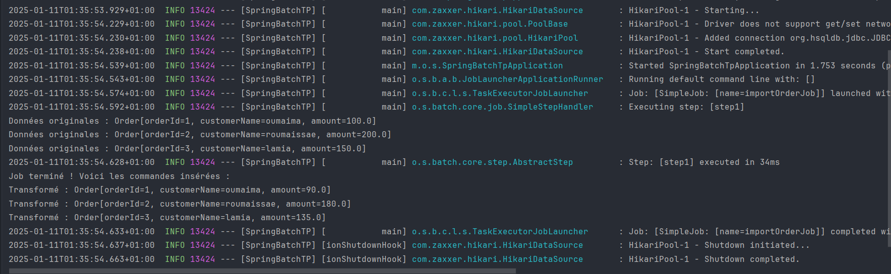

# TP Spring Batch : Traitement des Commandes

## Objectif

L'objectif de ce TP était de créer un job Spring Batch pour :
1. Lire des commandes depuis un fichier CSV.
2. Appliquer une remise de 10% sur le montant de chaque commande.
3. Écrire les commandes transformées dans une base de données HSQLDB.
4. Afficher les commandes insérées à la fin de l'exécution.

---

## Structure du Projet

### Fichiers Principaux
- **`orders.csv`** : Fichier CSV contenant les commandes à traiter.
- **`Order.java`** : Classe représentant une commande.
- **`OrderItemProcessor.java`** : Processeur pour appliquer une remise de 10%.
- **`BatchConfiguration.java`** : Configuration du job Spring Batch.
- **`JobCompletionListener.java`** : Listener pour afficher les commandes insérées.

### Base de Données
- **Table `orders`** : Table HSQLDB pour stocker les commandes transformées.

---

## Étapes Réalisées

### 1. Création du Fichier CSV
Le fichier `orders.csv` contient les colonnes suivantes :
- `orderId` : Identifiant de la commande.
- `customerName` : Nom du client.
- `amount` : Montant de la commande.

Exemple de contenu :
```csv
orderId,customerName,amount
1,oumaima,100.0
2,roumaissae,200.0
3,lamia,150.0
```

###  2. Configuration du Job Spring Batch
Le job Spring Batch a été configuré avec les composants suivants :
- **`FlatFileItemReader`** Pour lire les données du fichier CSV.
- **`OrderItemProcessor`** : Pour appliquer une remise de 10% sur le montant de chaque commande.
-**`JdbcBatchItemWriter`** : Pour écrire les commandes transformées dans la base de données.
- **`JobCompletionListener`**: Pour afficher les commandes insérées à la fin de l'exécution.

### 3. Affichage de résultat 

Les données transformées (avec remise) sont insérées dans la base de données et affichées à la fin de l'exécution


=======

